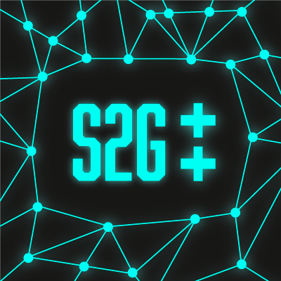

<div align="center">


# Series2Graph++

[](https://gitlab.hpi.de/akita/s2gpp/-/commits/main)
[](https://gitlab.hpi.de/phillip.wenig/s2gpp/-/releases/1.0.0)
[](https://opensource.org/licenses/MIT)
</div>

_Series2Graph++_ (S2G++) is a time series anomaly detection algorithm based on the [Series2Graph](https://helios2.mi.parisdescartes.fr/~themisp/series2graph/) (S2G) and the [DADS](https://hpi.de/naumann/s/dads) algorithms. 
S2G++ can handle multivariate time series whereas S2G and DADS can cope with only univariate time series. 
Moreover, S2G++ takes ideas from DADS to run distributedly in a computer cluster.
S2G++ is written in _Rust_ and leverages the [actix](https://github.com/actix/actix) and [actix-telepathy](https://github.com/wenig/actix-telepathy) libraries.

## Quick Start

### Requirements

- Rust 1.58
- openblas
- (Docker)

To have `openblas` available to the Rust build process, do the following on Debian (Linux):

```shell
sudo apt install build-essential gfortran libopenblas-base libopenblas-dev gcc
```

### Installation

#### From source

```shell
git pull https://gitlab.hpi.de/akita/s2gpp
cd s2gpp
cargo build
```

#### Docker

The base image `akita/rust-base` must be available to your machine.

```shell
git pull https://gitlab.hpi.de/akita/s2gpp
cd s2gpp
docker build s2gpp .
```

### Usage (bin)

#### Parameters

Pattern:
```shell
s2gpp --local-host <IP:Port> --pattern-length <Int> --latent <Int> --query-length <Int> --rate <Int> --threads <Int> --cluster-nodes <Int> --score-output-path <Path> [main --data-path <Path> | sub --mainhost <IP:Port>]
```

S2G++ expects one of two sub-commands with its specific parameters:

- `main` (The head computer in a cluster)
  - `data-path` (The path to the input time series)
- `sub` (The other computers in a cluster; only necessary in a distributed setting)
  - `mainhost` (The ip-address to the main computer in a cluster)

Before these sub-commands are used, general parameters must be defined:

- `local-host` (The ip-address with port to bind the listener on.)
- `pattern-length` (Size of the sliding window, independent of anomaly length, but should in the best case be larger.)
- `latent` (Size of latent embedding space. This space is the input for the PCA calculation afterwards.)
- `query-length` (Size of the sliding windows used to find anomalies (query subsequences). query-length must be >= pattern-length!)
- `rate` (Number of angles used to extract pattern nodes. A higher value will lead to high precision, but at the cost of increased computation time.)
- `threads` (Number of helper threads started besides the main thread. (min=1))
- `cluster-nodes` (Size of the computer cluster.)
- `score-output-path` (Path the score are written to.)
- `column-start-idx` (How many columns to skip)
- `column-end-idx` (Until which column to use (exclusive). Can also take negative numbers to count from the end.)
- `self-correction` (Whether S2G++ will correct the direction of the time embedding if too few
  transactions are available)

#### Input Format

The input format of the time series is expected to be a CSV with header. Each column represents a channel of the timeseries.
Sometimes, time series files include also the labels and an index. You can skip columns with the `column-start-idx` / `column-end-idx` range pattern. It behave like Python ranges.

### Usage (lib)

_Cargo.toml_
```toml
[dependencies]
s2gpp = "1.0.0"
```

_your Rust app_

```rust
fn some_fn(timeseries: Array2<f32>) -> Result<Array1<f32>, ()> {
  let params = s2gpp::Parameters::default();
  let anomaly_score = s2gpp::s2gpp(params, Some(timeseries))?.unwrap();
  Ok(anomaly_score)
}
```

## Python

We have wrapped the Rust code in a [Python package](https://pypi.org/s2gpp), that can be used without installing Rust.

### Installation

#### PyPI

```shell
pip install s2gpp
```

#### Build with Docker

```shell
make build-docker
pip install wheels/s2gpp-*.whl
```

#### Build from Source

```shell
make install
```

### Usage

#### Single Machine

```python
from s2gpp import Series2GraphPP
import pandas as pd

ts = pd.read_csv("data/ts_0.csv").values

model = Series2GraphPP(pattern_length=100)
anomaly_scores = model.fit_predict(ts)
```

#### Distributed

```python
from s2gpp import DistributedSeries2GraphPP
from pathlib import Path

# run on one machine
def main_node():
    dataset_path = Path("data/ts_0.csv")
  
    model = DistributedSeries2GraphPP.main(local_host="127.0.0.1:1992", n_cluster_nodes=2, pattern_length=100)
    model.fit_predict(dataset_path)

# run on other machine
def sub_node():
    model = DistributedSeries2GraphPP.sub(local_host="127.0.0.1:1993", mainhost="127.0.0.1:1992", n_cluster_nodes=2, pattern_length=100)
    model.fit_predict()
```

## Cite

Please cite this work, when using it!

## References

[1] P. Boniol and T. Palpanas, Series2Graph: Graph-based Subsequence Anomaly Detection in Time Series, PVLDB (2020) [link](https://helios2.mi.parisdescartes.fr/~themisp/series2graph/data/Series2Graph.pdf)

[2] Schneider, J., Wenig, P. & Papenbrock, T. Distributed detection of sequential anomalies in univariate time series. The VLDB Journal 30, 579–602 (2021). [link](https://doi.org/10.1007/s00778-021-00657-6)
